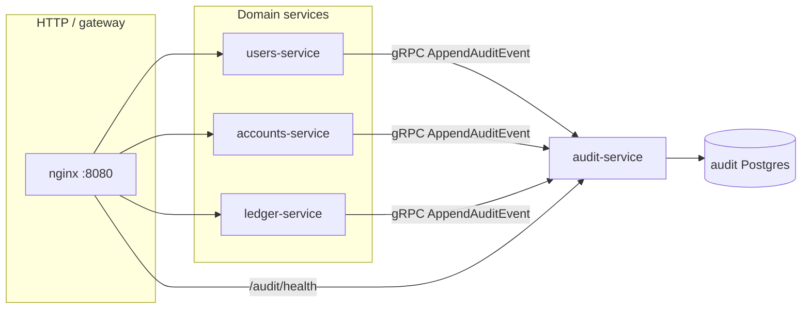
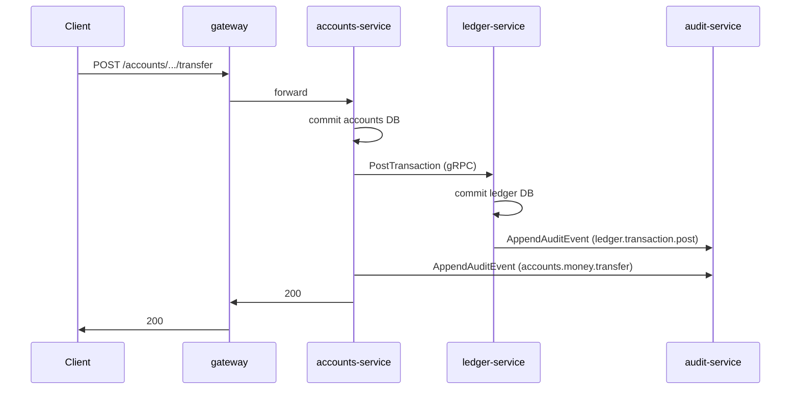
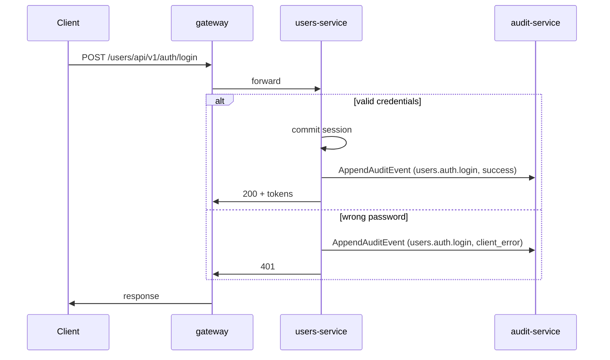

# Audit trail architecture (v1)

Central **append-only** audit ingest for Rails-Core. Domain services call **audit-service** over gRPC (`AppendAuditEvent`); rows are stored in a dedicated Postgres database with **no updates or deletes** enforced at the database layer.

## Database

**Manual provisioning (v1):** Neon bootstrap scripts in this repo do **not** create `audit_db`. For local or hosted Postgres:

- Create a database (e.g. `audit_db`) and role with `CREATE` on the schema.
- Set `AUDIT_DATABASE_URL` in `.env` (see repository `.env.example`).
- On first run, **audit-service** applies SQLx migrations (`services/audit-service/migrations/`), including append-only PostgreSQL `RULE`s on `audit_events`.

Indexes (v1): `(organization_id, occurred_at)`, `(correlation_id)`, `(action)`.

## System diagram

## Sequence: money transfer + ledger post

*(Exact emitter wiring in accounts-service and ledger-service follows the RAI-14 action catalog; ingest and storage are implemented in **audit-service**.)*

## Sequence: login success vs wrong password

## Contract

- **Proto:** `proto/audit/v1/audit.proto` — package `rails.core.audit.v1`, unary `AppendAuditEvent` only (no batch in v1).
- **Delivery:** Emitters should call audit **after** the primary domain transaction commits, with a **400 ms** client deadline; failures after a successful domain commit must be visible in logs and Sentry (see RAI-14), without rolling back business data.

## Service layout

| Component        | Path |
|-----------------|------|
| Protobuf        | `proto/audit/v1/audit.proto` |
| Ingest service  | `services/audit-service/` |
| Compose service | `docker-compose.yml` → `audit-service` |
| Gateway (HTTP)  | `gateway/nginx.conf` → `/audit/` → health |

## References

- Linear: RAI-14 (audit trail service), RAI-12 (health parity).
